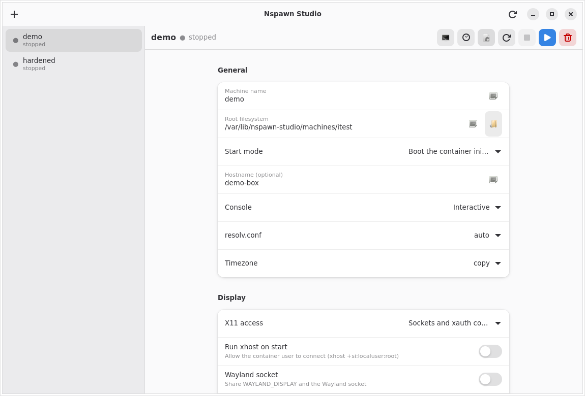

# Nspawn Studio

A small, focused GTK4 / libadwaita desktop application written in **Rust** for
creating, configuring and running [systemd-nspawn](https://www.freedesktop.org/software/systemd/man/latest/systemd-nspawn.html)
containers on Linux.

Nspawn Studio is a front end for the tools you already trust: `debootstrap`
creates the root filesystem, `systemd-nspawn` boots it, `systemd-run` and
`machinectl` keep it running, and `journalctl` shows you what happened. The
application never re-implements the container runtime; it generates a plain,
readable bash launcher and drives it.

*Managing a container: machine name, root filesystem, boot mode, hostname,
console, `resolv.conf`/timezone handling and the display/audio integration.*

---

## Features

* **Create containers two ways**
  * `debootstrap` a fresh Debian root filesystem (suite, mirror, architecture,
    variant and package list are all editable).
  * Import an existing chroot directory.
* **Generated launcher script** for every container at
  `/var/lib/nspawn-studio/scripts/<name>.sh`. It is a normal bash script you can
  read, run by hand with `sudo`, or audit. Every option you pick in the GUI ends
  up as an explicit `systemd-nspawn` flag.
* **Lifecycle management**: the play button opens the container in a terminal
  window (a booted container gives you its normal login prompt); the second
  button starts it in the background as a transient systemd unit. Stop works
  for both. The sidebar shows the live running/stopped state, including
  containers started from a terminal.
* **User and password provisioning**: set a root password and create any number
  of users, each with an optional sudo grant. The accounts are written into the
  container's root filesystem with `chpasswd`/`useradd` (run through
  systemd-nspawn), so the login prompt accepts them immediately. Applying is
  refused while the container is running.
* **Display integration**
  * X11: none, sockets only, or sockets + `XAUTHORITY` cookie
    (recommended; works out of the box).
  * `DISPLAY` and `XAUTHORITY` are exported through the container's
    `/etc/profile.d`, so programs started after `login:` see them (a bind
    mount, so this also works with a read-only root).
  * **Xephyr**: a private nested X server. The container gets its own display
    and the host only shows the Xephyr window. The screen size is configurable
    per container, and Xephyr is shut down again when the container stops.
  * Optional `xhost +si:localuser:root` on start.
  * Wayland socket sharing.
  * `/dev/dri` GPU passthrough.
* **Audio integration**: PipeWire, PulseAudio and ALSA (any combination).
* **Bind mounts**: expose any host folder inside the container, read-only or
  read-write, with one-click presets for the whole host filesystem (read-only)
  and your home directory.
* **Networking**: host networking, `--private-network`, or `--network-veth`
  with a bridge, plus `--port=` forwards.
* **Security and sandboxing**: capabilities and system call groups are picked
  from **checkbox menus with a short description for each option** instead of
  comma separated text boxes; user namespaces (`-U`) with ownership modes,
  read-only root, ephemeral mode, seccomp via `--system-call-filter=`,
  `no-new-privileges`, capability dropping/adding, `--inaccessible=` masking,
  `--tmpfs=` and raw extra
  arguments. A one-click **recommended hardening** profile (based on the
  `systemd-nspawn(1)` example) is included.
* **Optional systemd unit** generation for each container.

---

## Requirements

* Linux with systemd (nspawn, machinectl, systemd-run are part of systemd).
* Debian/Ubuntu-style host for the runtime tools:
  * `systemd-container` (systemd-nspawn, machinectl)
  * `debootstrap` (only needed to create new root filesystems)
* Build dependencies:
  * Rust 1.80 or newer (rustc + cargo)
  * `pkg-config`
  * GTK 4 development headers (`libgtk-4-dev`)
  * libadwaita development headers (`libadwaita-1-dev`)
  * a C toolchain (`build-essential` / `gcc`)

On Debian 13 "trixie" the whole list is:

    sudo apt update
    sudo apt install build-essential pkg-config libgtk-4-dev libadwaita-1-dev \
        rustc cargo git systemd-container debootstrap wget file patchelf \
        squashfs-tools desktop-file-utils xserver-xephyr

The application manipulates containers, so run it as **root** (or launch it with
`pkexec`/`sudo`). Containers are stored under `/var/lib/nspawn-studio`.

---

## Building and running

    git clone <this repository> nspawn-studio
    cd nspawn-studio
    cargo build --release
    sudo ./target/release/nspawn-studio

For development:

    cargo run -p nspawn-studio

Run the test suite (unit tests plus end-to-end launcher tests that execute the
generated script against a fake `systemd-nspawn`):

    cargo test

or the convenience script:

    ./scripts/verify.sh

The binary can also regenerate a launcher without opening the GUI:

    sudo ./target/release/nspawn-studio --render <container-name>
    # prints the path of the rewritten launcher script

---

## Building an AppImage (x86_64)

The repository ships a script that builds a self-contained AppImage for
x86_64:

    ./scripts/build-appimage.sh

It performs the following steps:

1. `cargo build --release -p nspawn-studio`
2. Assembles an AppDir with the binary, a `.desktop` file, the icon and an
   `AppRun` entry point.
3. Downloads `appimagetool` (x86_64) into `target/appimage-tools/` if needed.
4. Produces `dist/nspawn-studio-<version>-x86_64.AppImage`.

Run it with:

    chmod +x dist/nspawn-studio-*.AppImage
    sudo ./dist/nspawn-studio-*.AppImage

> **FUSE.** The AppImage is a type-2 AppImage and needs FUSE 2 to mount itself.
> If it is missing, install `libfuse2` / `libfuse2t64`, or run it with
> `./dist/nspawn-studio-*.AppImage --appimage-extract-and-run`.

> **Note on libraries.** The AppImage bundles the application itself and relies
> on the host for GTK 4 and libadwaita (which any current desktop already has).
> If you need a fully self-contained bundle, add the libraries with
> `linuxdeploy`:

    linuxdeploy --appdir target/appimage/nspawn-studio.AppDir \
        --plugin gtk --output appimage

The application also needs `systemd-container` and (for new root filesystems)
`debootstrap` installed on the host, because it calls those system tools.

---

## Building an AppImage for arm64 (cross-compile)

On a Debian/Ubuntu **x86_64** host you can cross-compile a native aarch64
binary and package it with the aarch64 `appimagetool`:

    sudo ./scripts/build-arm64.sh

The script enables the `arm64` architecture, installs
`gcc-aarch64-linux-gnu`, `qemu-user-static` + `binfmt-support` (needed to run
the aarch64 `appimagetool`), the arm64 `libgtk-4-dev` / `libadwaita-1-dev`
libraries, and a Rust toolchain with the `aarch64-unknown-linux-gnu` target.
It then cross-compiles and writes
`dist/nspawn-studio-<version>-aarch64.AppImage`.

The generic `build-appimage.sh` is architecture aware:

    ARCH=aarch64 TARGET=aarch64-unknown-linux-gnu ./scripts/build-appimage.sh

`ARCH` selects the appimagetool build (and the output file name), `TARGET`
selects the Rust target triple and therefore which binary gets packaged.

Notes for arm64:

* Run the AppImage on the arm64 machine (`chmod +x` then `sudo`). On the
  x86_64 build host you can smoke test it with qemu (the static-pie AppImage
  runtime is not always dispatched through binfmt_misc automatically):
  `qemu-aarch64-static ./dist/nspawn-studio-*-aarch64.AppImage --appimage-extract-and-run --version`.
* On the arm64 machine the same runtime dependencies apply:
  `systemd-container`, `debootstrap` and the distro's GTK4/libadwaita.
* An arm64 host does not need any cross setup: `./scripts/build-appimage.sh`
  detects `aarch64` and produces `dist/nspawn-studio-<version>-aarch64.AppImage`.

---

## What the generated launcher looks like

Every time a container configuration is saved, Nspawn Studio writes
`/var/lib/nspawn-studio/scripts/<name>.sh`. A shortened example:

    #!/usr/bin/env bash
    set -euo pipefail
    NAME='demo'
    ROOTFS='/var/lib/nspawn-studio/machines/demo'
    ARGS=()
    ARGS+=("--machine=$NAME")
    ARGS+=("--directory=$ROOTFS")
    ARGS+=(--console=interactive)
    ARGS+=(-b)
    ARGS+=(-U)
    ARGS+=(--no-new-privileges=yes)
    ARGS+=(--drop-capability=CAP_SYS_ADMIN)
    ARGS+=(--private-network)
    ARGS+=(--port=tcp:8080:80)
    ARGS+=(--bind-ro='/srv/data:/data')
    if [[ -d /tmp/.X11-unix ]]; then
      ARGS+=(--bind=/tmp/.X11-unix)
    fi
    if [[ -f "$XAUTH" ]]; then
      ARGS+=(--bind-ro="$XAUTH:/root/.Xauthority")
      ARGS+=(--setenv=XAUTHORITY=/root/.Xauthority)
    fi
    exec systemd-nspawn "${ARGS[@]}" "$@"

The script resolves session-specific values (`DISPLAY`, `XAUTHORITY`,
`XDG_RUNTIME_DIR`, the PipeWire/PulseAudio/Wayland sockets) at run time, so the
same file works from a terminal and from a systemd unit. When it is executed by
systemd it switches to `--console=read-only` automatically.

---

## Accounts and passwords

The **Users and passwords** section of a container lets you:

* set the **root password**;
* **add users** (name, password, and whether the account gets sudo);
* **Apply users and passwords** to the container.

Applying runs a small shell script inside the container with
`systemd-nspawn -D <rootfs> /bin/sh -c ...`. It creates the accounts, sets
their passwords, creates the `sudo` group and a
`/etc/sudoers.d/90-nspawn-studio` drop-in, and installs the `sudo` package
if it is missing. The new-container dialog has the same fields, and applies
them automatically once the root filesystem exists (after debootstrap, when
you ask it to build now).

Passwords are stored in plain text in the container configuration
(`/var/lib/nspawn-studio/containers/<name>.json`) so the container can be
re-provisioned later. That file is root-only (mode 0600). Leave the password
blank to keep an existing password unchanged.

## Where things are stored

| Path | Purpose |
| --- | --- |
| `/var/lib/nspawn-studio/containers/<name>.json` | container configuration |
| `/var/lib/nspawn-studio/scripts/<name>.sh` | generated launcher |
| `/var/lib/nspawn-studio/containers/<name>.json` | also stores root/user passwords, mode 0600 |
| `/var/lib/nspawn-studio/units/<name>.service` | optional systemd unit |
| `/var/lib/nspawn-studio/machines/<name>/` | default root filesystem |

Set `NSPAWN_STUDIO_HOME` to relocate everything (useful for testing).

---

## Project layout

    nspawn-studio/
    |- Cargo.toml                 # cargo workspace
    |- core/                      # no GUI dependencies, fully unit tested
    |  |- src/model.rs            # container data model (serde)
    |  |- src/validate.rs         # name/path/capability validation
    |  |- src/generator.rs        # systemd-nspawn launcher + unit generation
    |  |- src/store.rs            # on-disk configuration store
    |  |- src/command.rs          # systemctl / machinectl / systemd-run helpers
    |  '- tests/launcher_integration.rs
    |- gui/                       # GTK4 + libadwaita front end
    |  '- src/{main,state,detail,create,widgets,task}.rs
    |- data/                      # .desktop file and icon
    |- scripts/
    |  |- build-appimage.sh
    |  '- verify.sh
    '- README.md

The split exists so the interesting logic (what flags are produced, how
configurations are validated and stored) can be tested without a display
server.

---

## Testing and verification

`cargo test -p nspawn-studio-core` runs:

* model serialisation round-trips and backwards-compatible defaults,
* validation of names, paths, ports, capabilities and mounts,
* generator tests for every option (boot/command, X11, audio, Wayland, GPU,
  mounts, networking, hardening, extra arguments, debootstrap argv, unit file),
* store tests (save/load/delete, file permissions, path containment),
* command helper tests (output capture, state parsing, machinectl parsing),
* **integration tests** that write a generated launcher, check it with
  `bash -n`, then execute it with a fake `systemd-nspawn` on `PATH` and assert
  that the exact expected flags and runtime guards are passed through.

`./scripts/verify.sh` runs the tests, builds the release binary and performs a
short GUI smoke test.

---

## Security notes

* The launcher refuses to run unless it is executed as root, and refuses to run
  when the root filesystem does not exist.
* Machine names, paths and capabilities are validated before they reach a
  command line; the generated script quotes every value.
* Deleting a root filesystem is only allowed when it lives inside the store's
  `machines/` directory.
* Account passwords live in the root-only container configuration (mode 0600).
* The recommended hardening profile uses a user namespace, a seccomp
  system-call filter, dropped capabilities and `no-new-privileges`. It has been
  verified to boot a Debian container cleanly. `--inaccessible=` masking is
  available for paths that exist inside the container image; kernel-provided
  paths such as `/proc/kcore` cannot be masked this way because they do not
  exist in the on-disk root filesystem.
